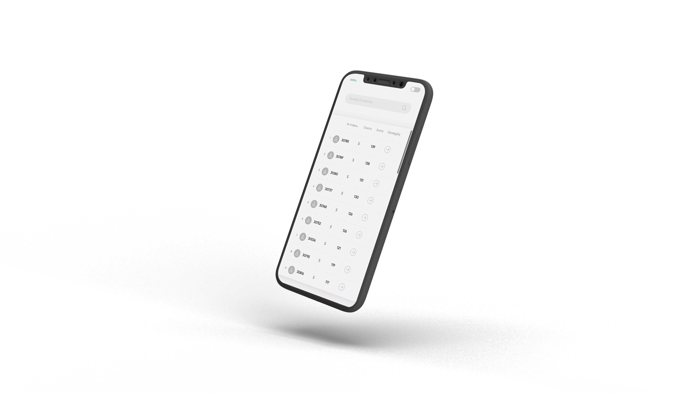
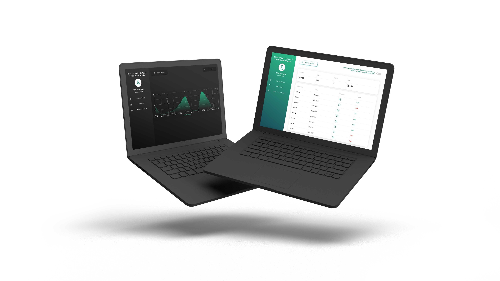

### Grades - university project

Grades client project for university subject to check current results of every single student.

This project was created for the university purpose.
Students were asked to create client for subject results. Data was provided by a lecturer,
so I decided to do my best and focus on user experience and user interface design.
Results are available in the link below. (Unfortunately result comparison doesn't
work on deployed site, just because provided data use http instead of https protocol.
Netlify hosting doesn't allow to make a http request, so this feature is not available).

#### `Technologies used:`

- Gatsby, Gatsby Node API
- Recharts, React-table

